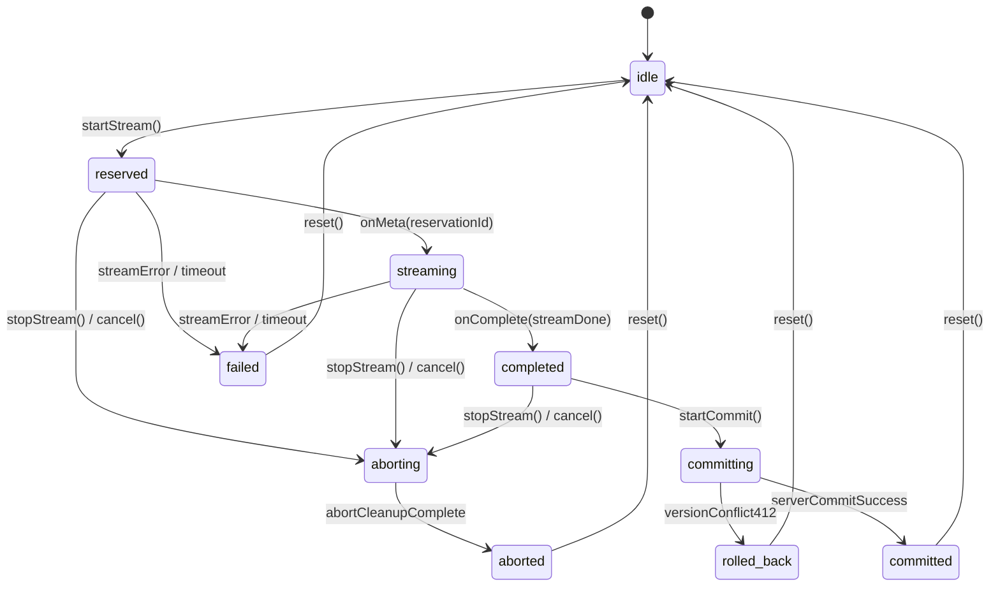

# UI Streaming Architecture & Implementation Specification

## 1. Executive Overview

This document specifies the architecture and implementation of the **Hybrid Streaming & Snapshot Architecture** in the LUGX platform, restoring real-time perceived UI streaming while guaranteeing absolute data integrity, single-action atomic undo, idempotent quota accounting, and optimistic version protection.

### Primary System Invariant:
> **No network chunk is ever written directly to the active document state, the local IndexedDB database, or the remote database.**
> Streaming tokens update an isolated in-memory ephemeral buffer and view-layer preview overlay. The document is committed in exactly one atomic transaction only after stream completion and server version validation.

---

## 2. Readiness Gates Compliance Matrix (G1 - G10)

| Gate | Specification | Implementation File(s) | Status |
| :--- | :--- | :--- | :--- |
| **G1** | Idempotent reservation record (`ai_reservations`) with unique `operationId` constraint and conditional state transitions. | `src/lib/db/schema.ts`<br>`src/lib/db/migrations/0005_ai_reservations.sql`<br>`src/server/actions/ai-ops.ts` | **Implemented** |
| **G2** | Server atomic commit endpoint/action combining file update and reservation settlement with version lock. | `src/server/actions/ai-commit.ts` | **Implemented** |
| **G3** | Full `AbortController` lifecycle, `reader.cancel()` cleanup, and server-side disconnect refund. | `src/hooks/use-ai-stream.ts`<br>`src/lib/ai/stream-handler.ts`<br>`src/app/api/ai/stream/route.ts` | **Implemented** |
| **G4** | Deterministic UTC-based `periodKey` (`UTC_YYYY-MM-DD`) assigned at reservation time and preserved across transitions. | `src/server/actions/ai-ops.ts` | **Implemented** |
| **G5** | Auto-save and sync suspension invariants during active streaming, committing, and conflict states. | `src/hooks/use-editor-orchestrator.ts`<br>`src/app/workspace/editor/[fileId]/page.tsx` | **Implemented** |
| **G6** | Stale session and generation guard (`editorGeneration`) preventing old callbacks from applying to new state. | `src/lib/ai/stream-session.ts`<br>`src/hooks/use-ai-stream.ts` | **Implemented** |
| **G7** | Production path integration tests calling real server actions and schema entities. | `src/test/ai-quota-idempotency.test.ts`<br>`src/test/ai-server-atomic-commit.test.ts` | **Implemented** |
| **G8** | Multi-byte UTF-8 split boundary tests, NDJSON line framing tests, and 412 conflict tests. | `src/test/ai-stream-parser.test.ts`<br>`src/test/ai-stream-session.test.ts`<br>`src/test/editor-atomic-commit.test.ts` | **Implemented** |
| **G9** | Editor orchestration and authoritative write integration tests with zero regression. | `src/test/editor-orchestration.integration.test.ts`<br>[`docs/architecture/editor-sync-orchestration.md`](../architecture/editor-sync-orchestration.md) | **Validated** |
| **G10** | Feature Flag gating (`AI_STREAMING_ENABLED = false` by default) with zero sensitive prompt leakage in server logs. | `src/config/features.config.ts`<br>`src/app/api/ai/stream/route.ts` | **Implemented & Enforced (v1.5.0)** — the route now branches on the flag with `processWithAI` as a buffered NDJSON fallback |
| **G11** | Zero-Knowledge AI Safety Gatekeeper: amber UI privacy badge (`ai-encrypted-badge`), HTTP 403 pre-reservation route check (`AI_PROHIBITED_ON_ENCRYPTED_FILES`), and commit IV re-encryption guard. | `src/components/editor/ai-toolbar.tsx`<br>`src/hooks/use-editor-orchestrator.ts`<br>`src/app/api/ai/stream/route.ts`<br>`src/server/actions/ai-commit.ts` | **Implemented & Enforced (v1.25.0)** |

---

## 3. Dual Atomicity Model

To prevent distributed transaction failure modes, the system decouples commit into two deterministic phases:

```mermaid
flowchart TD
    Client["Client Session: completed"] --> Step1["Step 1: Server Commit (commitAIFileOperation)"]
    Step1 --> VerifyRes["Verify ai_reservations status == 'reserved'"]
    Step1 --> VerifyVer["Verify files.version == expectedVersion"]
    Step1 --> VerifyZK["Verify Vault Opt-In & Encryption Metadata (if encrypted)"]
    
    VerifyRes & VerifyVer & VerifyZK --> TxCommit["UPDATE files (content, version + 1, new etag)<br/>UPDATE ai_reservations (status = 'committed')"]
    
    TxCommit -->|Version Conflict / 412 or Security Error| Rollback["Rollback ephemeral state & refund quota (refundAIReservation)"]
    TxCommit -->|Success (200 OK)| Step2["Step 2: Local Commit (Single Atomic Transaction)"]
    
    Step2 --> Dismantle["Dismantle Ephemeral Preview Overlay"]
    Step2 --> Replace["adapter.replaceRange(from, to, previewMarkdown)"]
    Step2 --> Undo["Push 1 History Stack Entry (Undoable with single Ctrl+Z)"]
    Step2 --> IDBSync["Sync to local IndexedDB with server ETag"]
```

---

## 4. Session Finite State Machine (FSM)



---

## 5. NDJSON Framing Protocol Specification

The `/api/ai/stream` endpoint streams framed newline-delimited JSON (NDJSON) events over an HTTP response with headers `Content-Type: application/x-ndjson; charset=utf-8`:

### 5.1 Meta Event
Emitted immediately upon successful quota reservation before AI generation starts:
```json
{"type":"meta","sessionId":"session_abc123","reservationId":"res_def456","operationId":"op_ghi789"}
```

### 5.2 Delta Event
Emitted for each incoming token or text chunk from Gemini:
```json
{"type":"delta","text":"Partial generated text..."}
```

### 5.3 Done Event
Emitted on clean EOF stream termination:
```json
{"type":"done"}
```

### 5.4 Error Event
Emitted if an error occurs during stream transmission:
```json
{"type":"error","code":"STREAM_FAILED","message":"Connection timed out","retryable":true}
```

---

## 6. Failure Recovery & Quota Idempotency

### 6.1 Idempotent Quota Refund
When a session is cancelled or fails, `refundAIReservation(operationId, reason)` is triggered:
- **Condition:** Updates `status = 'refunded'` WHERE `operation_id = operationId AND status = 'reserved'`.
- **Idempotency:** Subsequent refund calls with the same `operationId` find `status == 'refunded'` and immediately return `{ refunded: false, reason: "already_refunded" }`, eliminating double-refund risks.
- **Period Key Safety:** Reverts daily/weekly usage counters on the EXACT `periodKey` (UTC date) recorded at reservation time, preventing counter mismatches across midnight boundaries.

### 6.2 Stale Reservation Sweeper (TTL)
`expireStaleReservations()` queries all `ai_reservations` where `status = 'reserved'` AND `expires_at <= now()`. It transitions them to `expired` and restores the quota, ensuring abandoned client tabs do not leak quota balances.

### 6.3 Streaming Terminality & Watchdogs (v1.5.0 Amendment)

Runtime remediation closed four compounding defects that produced an invisible ghost
preview and a perceived infinite send/receive deadlock (full root-cause matrix in
`AI_KEY_ROTATION_AND_STREAMING_RESILIENCE.md` §5a):

- **Single terminal callback, absolutely:** rejections inside the async atomic-commit
  pipeline are routed back into `onError` instead of becoming unhandled promise
  rejections — the ghost is always dismantled, the reservation refunded, and the in-flight
  trigger mutex released.
- **Provider-side cancellation:** the `AbortSignal` is forwarded into Gemini SDK request
  options, so aborts and disconnects terminate the upstream socket.
- **Watchdogs:** first-chunk (`20s`) and absolute-duration (`120s`) ceilings fail closed
  with structured errors (`AI_STREAM_FIRST_CHUNK_TIMEOUT`, `AI_STREAM_DURATION_EXCEEDED`).
- **Preview buffer integrity:** only the latest delta is appended to
  `EphemeralPreviewBuffer` (previously the accumulated text was re-appended per chunk,
  growing it quadratically).

New verification suites: `src/test/ai-stream-completion-terminality.test.ts` (terminality,
watchdog fail-closed) and `src/test/ai-client-abort-propagation.test.ts` (signal reaches
SDK request options).

---

## 7. Configuration & Feature Flags

Feature flags are centralized in `src/config/features.config.ts`:
```typescript
export const FEATURES = {
    AI_STREAMING_ENABLED: process.env.NEXT_PUBLIC_AI_STREAMING_ENABLED === "true",
    RESERVATION_TTL_MS: 5 * 60 * 1000,
    PREVIEW_BUFFER_MAX_CHARS: 500_000,
};
```
`AI_STREAMING_ENABLED` defaults to `false`; as of v1.5.0 the route handler actively
branches on it — when disabled, generation runs through the `processWithAI` buffered
accumulator path and is framed to the client as a single NDJSON chunk (identical wire
protocol, non-incremental delivery). All modules, schema migrations, and contracts remain
tested and ready for progressive canary activation by setting the flag to `true`.
