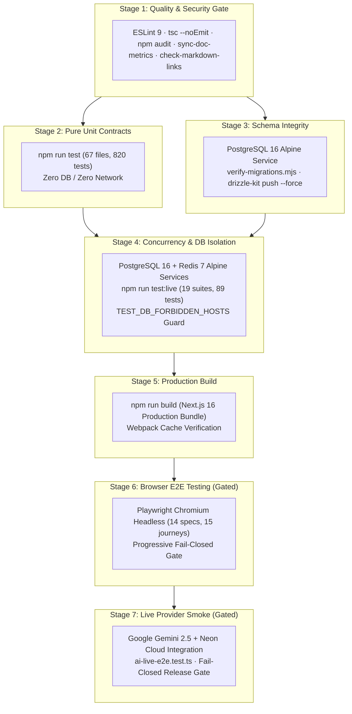
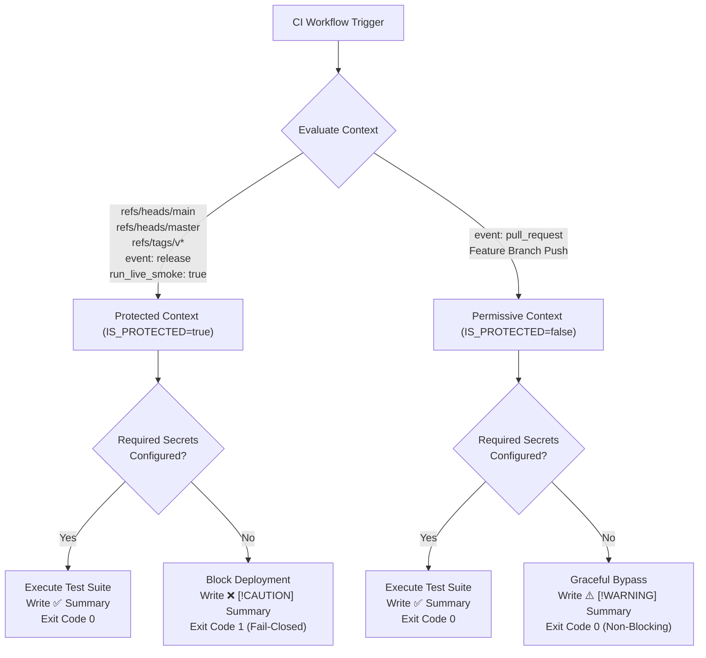

# CI/CD Pipeline & Fail-Closed Release Gate Specification

**Status:** ✅ Living Contract · Pre-Stage 2 Core Hardening (Phase 3)  
**Authoritative Workflow:** [`.github/workflows/ci.yml`](file:///d:/Projects/LUGX/.github/workflows/ci.yml)  
**Verification Harness:** [`scripts/test-ci-gating.mjs`](file:///d:/Projects/LUGX/scripts/test-ci-gating.mjs) (`npm run test:ci-gate`)  
**Associated Contracts:** [`docs/reference/test-database-isolation.md`](file:///d:/Projects/LUGX/docs/reference/test-database-isolation.md)

---

## 1. Overview & Architectural Purpose

The LUGX CI/CD pipeline enforces a deterministic 7-stage quality, concurrency, schema integrity, and end-to-end browser validation lifecycle on GitHub Actions.

Prior to Phase 3 hardening, Stages 6 (Playwright E2E) and 7 (Live Provider Smoke) suffered from a **Silent Skip with Exit 0** vulnerability: when required repository secrets were not configured, the workflow skipped test execution and exited with code 0, providing a false impression of verification.

Phase 3 introduces:
1. **Progressive Fail-Closed Release Gating:** Strict enforcement of non-zero termination (`exit 1`) for production and release branches when required credentials are missing, blocking any unverified deployment.
2. **Permissive Fork PR Gating:** Graceful bypass (`exit 0`) with prominent warning banners for external pull requests where repository secrets are inaccessible.
3. **Structured `$GITHUB_STEP_SUMMARY` Tables:** Automatic generation of GitHub Flavored Markdown summary tables displaying secret status, target browsers, execution contexts, and test counts directly on the GitHub Actions dashboard.

---

## 2. Pipeline Stage Architecture



---

## 3. Seven-Stage Specification Matrix

| Stage | Identifier | Runner / Service | Commands & Tools | Isolation & Security Guarantees |
| :--- | :--- | :--- | :--- | :--- |
| **1. Quality & Security** | `quality-gate` | `ubuntu-latest` | `npm ci`, `npm run lint`, `npx tsc --noEmit`, `npm audit --audit-level=high`, `sync-doc-metrics.mjs --check`, `check-markdown-links.mjs` | Zero external network calls; static analysis, type checking, security audit, and documentation metrics/link synchronization. |
| **2. Pure Unit Contracts** | `unit-contracts` | `ubuntu-latest` | `npm run test` | Hermetic execution via `vitest.config.mts`; strictly excludes all `LIVE_TEST_FILES`. |
| **3. Schema Integrity** | `migration-integrity` | `ubuntu-latest` + `postgres:16-alpine` | `scripts/verify-migrations.mjs`, `npx drizzle-kit push --config drizzle.config.test.ts --force` | Validates clean schema application and confirms zero drift between Drizzle ORM schema and SQL migration files. |
| **4. Concurrency & Isolation** | `concurrency-and-db-isolation` | `ubuntu-latest` + `postgres:16-alpine` + `redis:7-alpine` | `npm run test:live` | Runs 19 live integration suites against isolated containers; enforces `TEST_DB_FORBIDDEN_HOSTS` to block accidental production connections. |
| **5. Production Build** | `build-verification` | `ubuntu-latest` | `npm run build` | Validates complete Next.js 16 production build compilation with route tree generation and asset optimization. |
| **6. Browser E2E Testing** | `e2e-browser-testing` | `ubuntu-latest` | `npx playwright test` | Executes 14 Playwright specs across 15 user journeys in headless Chromium. Gated by progressive fail-closed rules. |
| **7. Live Provider Smoke** | `live-provider-smoke` | `ubuntu-latest` | `npx vitest run src/test/ai/ai-live-e2e.test.ts --config vitest.live.config.ts` | Gated verification of live Google Gemini API and cloud database connectivity. Strictly fail-closed on release branches. |

---

## 4. Progressive Gating Decision Matrix

The CI workflow differentiates between **Protected Contexts** (where test execution is strictly mandatory) and **Permissive Contexts** (where external pull requests lack secret access):



### Detailed Gating Specification

| Execution Context | Trigger Definition | Required Secrets Available | Required Secrets Missing | Terminal Exit Code | Step Summary Output |
| :--- | :--- | :--- | :--- | :--- | :--- |
| **Production Branch** | `push` to `main` or `master` | Full execution | **Fail-Closed ❌** | `1` | `[!CAUTION]` Blocked deployment alert + missing secrets table |
| **Release Tag** | `push` matching `refs/tags/v*` | Full execution | **Fail-Closed ❌** | `1` | `[!CAUTION]` Release gate failure alert + missing secrets table |
| **Release Published** | `release: [published]` | Full execution | **Fail-Closed ❌** | `1` | `[!CAUTION]` Release publication failure alert + missing secrets table |
| **Manual Live Smoke** | `workflow_dispatch` with `run_live_smoke: true` | Full execution | **Fail-Closed ❌** | `1` | `[!CAUTION]` Cloud provider smoke refusal alert |
| **Pull Request (Fork)** | `pull_request` from fork | Full execution | **Permissive Skip ⚠️** | `0` | `[!WARNING]` Graceful skip notice + context classification table |
| **Feature Branch** | `push` to non-main branch | Full execution | **Permissive Skip ⚠️** | `0` | `[!WARNING]` Non-protected skip notice |

---

## 5. Secret Requirements by Stage

### Stage 6 (Playwright E2E Browser Testing)

| Secret Name | Gating Level | Fallback Mechanism |
| :--- | :--- | :--- |
| `TEST_DATABASE_URL` | **Mandatory** | None. Missing triggers fail-closed in protected contexts. |
| `NEXT_PUBLIC_SUPABASE_URL` | **Mandatory** | None. Required for client-side authentication mocking and token resolution. |
| `SUPABASE_SERVICE_ROLE_KEY` | **Mandatory** | None. Required for server-side test user provisioning and teardown. |
| `NEXT_PUBLIC_SUPABASE_ANON_KEY` | Optional | Defaults to dummy anon token if unconfigured. |
| `STRIPE_SECRET_KEY` | Optional | Handled via internal test mocks during standard browser runs. |
| `STRIPE_WEBHOOK_SECRET` | Optional | Handled via internal webhook fixture signers. |
| `UPSTASH_REDIS_REST_URL` | Optional | Falls back to in-memory mock or container service. |
| `GEMINI_KEY_1` | Optional | Client UI mocks AI streaming responses in browser tests. |

### Stage 7 (Live Provider Smoke Tests)

| Secret Name | Gating Level | Description |
| :--- | :--- | :--- |
| `TEST_DATABASE_URL` | **Mandatory** | Isolated Neon cloud database branch (`ep-*-pooler`). Must satisfy `assertSafeTestDatabaseUrl`. |
| `GEMINI_KEY_1` | **Mandatory** | Live Google Gemini API key for real LLM round-trip streaming verification. |

---

## 6. Dashboard Reporting Contract (`$GITHUB_STEP_SUMMARY`)

Every run of Stage 6 and Stage 7 writes structured Markdown to `$GITHUB_STEP_SUMMARY`. The output conforms to the following standards:

1. **Header Identification:** Level-2 heading with status emoji (`## ❌ FAILED`, `## ⚠️ SKIPPED`, or `## ✅ PASSED`).
2. **Alert Block:** GitHub Flavored Markdown alert block (`> [!CAUTION]` for fail-closed blocks, `> [!WARNING]` for permissive skips).
3. **Audit Table:** Markdown table itemizing each secret, its resolved status (`✅ Configured` or `❌ Missing`), and its context classification.
4. **Resolution Directive:** Explicit instructions detailing how repository operators can configure missing secrets under Repository Settings.

---

## 7. Local Simulation & Verification

The gating logic and step summary rendering can be validated locally without triggering cloud workflows:

```bash
# Run the deterministic CI gating simulation matrix (30 assertions)
npm run test:ci-gate

# Run markdown link verification
npm run lint:links

# Verify documentation test metrics synchronization
node scripts/sync-doc-metrics.mjs --check
```
