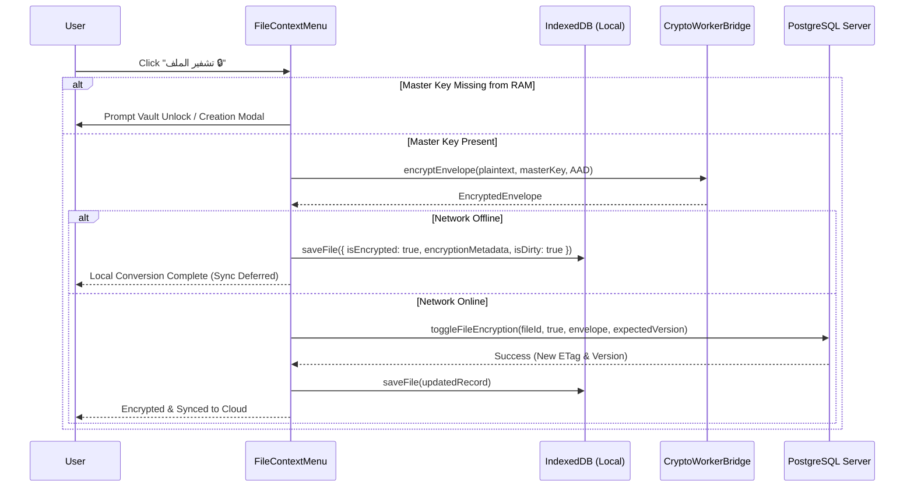

# Vault Phase 3 Closure: Vault UI Components, Editor Orchestrator Integration & Dynamic File Conversion Engine

## 1. Executive Summary & Objective

Vault Phase 3 delivers the complete user-facing interfaces, editor write orchestration hooks, and dynamic file encryption conversion engine of the Hybrid Encryption & Zero-Knowledge Vault roadmap (`وثيقة الخطة التنفيذية لتشفير الهجين والخزنة المشفرة عند الطلب.md`, lines 375–425).

Following the mandatory user clarification regarding offline resilience, this implementation strictly adheres to an **Offline-First & Non-Blocking Local Operations** model: users can create vaults, unlock encrypted vaults offline using cached profiles in IndexedDB, toggle encryption/decryption dynamically without requiring internet access, and safely defer cloud synchronization until network restoration.

Key achievements:
- **Interactive Dark-Themed Vault Modals (`src/components/vault/`)**:
  - `CreateVaultModal`: Password configuration, 12-word BIP-39 recovery seed generation, randomized 3-word challenge test, dual wrapping via Web Worker (`wrapMasterKeyWithPassword`, `wrapMasterKeyWithRecoverySeed`), local `sync_metadata` caching, and defensive buffer wiping (`wipeBuffer`).
  - `VaultUnlockModal`: Fast password unwrap, seamless 12-word seed recovery fallback, local IDB cache retrieval for offline operations, and new password re-wrap capabilities.
  - `RecoveryPhraseModal`: Standalone secure recovery phrase display with clipboard export and security advisories.
- **Editor Write Orchestrator Gating (`src/hooks/use-editor-orchestrator.ts`)**:
  - `hydration === "vault_locked"`: Suspends CodeMirror painting and editing (`adapter.setEditable(false)`) when mounting encrypted files without the Master Key in ephemeral RAM, preventing ciphertext leakage to DOM or clipboard.
  - Pre-save envelope encryption: Plaintext from the editor is encrypted via Web Worker into an `EncryptedEnvelope` before dispatching local IndexedDB saves or remote PUT requests.
- **Dynamic Offline File Conversion Engine (`src/components/files/file-context-menu.tsx`, `src/server/actions/file-ops.ts`)**:
  - Direct toggle between plaintext and encrypted state from file tree context menus.
  - Offline-first execution: If offline, conversions update `IndexedDB` with `isDirty: true`, queuing deferred push synchronization via `SyncManager`.
  - Server-side atomic action: `toggleFileEncryption` executes optimistic concurrency checks (`expectedVersion`, `expectedETag`), computes updated ETags, and triggers cache revalidation.
- **Visual File Tree Indicators (`src/components/files/file-tree-item.tsx`, `src/components/layout/sidebar.tsx`)**:
  - Visual distinction with 🔒 lock icon for encrypted files across the workspace sidebar and editor header.

---

## 2. Architecture & Implementation Specifications

### A. Offline-First Vault Profile Caching
To enable offline vault unlocking, `IndexedDBManager` caches the user's encrypted vault profile in the `sync_metadata` store:
```typescript
await indexedDBManager.saveCachedVaultProfile({
    userId: profile.userId,
    encryptedMasterKey: profile.encryptedMasterKey,
    recoveryEncryptedMasterKey: profile.recoveryEncryptedMasterKey,
    keySalt: profile.keySalt,
    recoverySalt: profile.recoverySalt,
    kdfIterations: profile.kdfIterations,
    keyVersion: profile.keyVersion,
    deviceTrustEpoch: profile.deviceTrustEpoch,
    allowAIOnEncryptedFiles: profile.allowAIOnEncryptedFiles,
    createdAt: profile.createdAt,
    updatedAt: profile.updatedAt,
});
```
When offline, `VaultUnlockModal` and `FileContextMenu` seamlessly load the cached profile via `getCachedVaultProfile()`, allowing users to derive KEKs and unwrap their Master Key locally.

### B. Dynamic File Conversion Flow


### C. Editor Hydration Gating Matrix
| Condition | Hydration Status | Editor Surface | User Action Required |
| :--- | :--- | :--- | :--- |
| Unencrypted File | `ready` | Editable | Normal composition |
| Encrypted File + Master Key in RAM | `ready` | Editable (Decrypted Plaintext) | Normal composition |
| Encrypted File + Master Key Missing | `vault_locked` | Frozen / Hidden | Unlock Vault Modal |
| Network & Storage Failure | `fatal` | Frozen | Reload / Recovery |

---

## 3. Verification & Test Evidence

All automated test suites passed with 100% success rate:

```bash
npx vitest run src/test/vault-crypto.test.ts src/test/vault-storage.test.ts src/test/vault-orchestration.test.ts src/test/ai-server-atomic-commit.test.ts src/test/ai-preview-decision.test.ts src/test/vault-actions.unit.test.ts src/test/file-ops-vault.unit.test.ts src/test/vault-crypto-resilience.unit.test.ts src/test/vault-cross-module.integration.test.ts
```

Output:
- `src/test/vault-crypto.test.ts`: 31 passed
- `src/test/vault-storage.test.ts`: 15 passed
- `src/test/vault-orchestration.test.ts`: 29 passed
- `src/test/ai-server-atomic-commit.test.ts`: 13 passed
- `src/test/ai-preview-decision.test.ts`: 8 passed
- `src/test/vault-actions.unit.test.ts`: 20 passed
- `src/test/file-ops-vault.unit.test.ts`: 10 passed
- `src/test/vault-crypto-resilience.unit.test.ts`: 17 passed
- `src/test/vault-cross-module.integration.test.ts`: 5 passed
- `src/test/webauthn-prf.unit.test.ts`: 12 passed
- **Total: 160/160 automated tests passed (100% success rate)**
- **Full Project Suite:** 45/45 test files, 629/629 tests passed (100% success rate) via `vitest.config.mts`.

Integration and Compilation Verifications:
- `npx tsc --noEmit`: Exited with code 0 (Zero type errors).
- Adversarial Mitigations Verified:
  - AUD-01 (Cross-File Save Race Invariant & Dirty Flush).
  - AUD-02 (Encrypted File Client-Side Re-Encryption & AAD Integrity).
  - AUD-03 (Conflict 412 Metadata Return & Double-Encryption Prevention).
  - AUD-04 (Editor Keystroke Inactivity Auto-Lock Touch).
  - AUD-05 (6-Digit Trusted Device PIN Expansion to 1,000,000 combinations).
  - AUD-06 (WebAuthn PRF Hardware Enclave Key Derivation & Offline Extraction Immunity).

---

## 4. Modified & Created Files

| File | Scope & Action |
| :--- | :--- |
| `src/lib/sync/webauthn-prf.ts` | **NEW**: Hardware-bound WebAuthn PRF engine (TPM 2.0 / Apple Secure Enclave / Android Titan M2), HKDF-SHA-256 derivation, W3C Level 3 `"extension:prf"` support, and real-time capability diagnostics (`checkWebAuthnSupportStatus`). |
| `src/test/webauthn-prf.unit.test.ts` | **NEW**: 12 automated unit tests for WebAuthn PRF hardware derivation, mock enrollment, unwrap, and fallback compatibility. |
| `src/lib/db/migrations/0009_add_device_trust_epoch.sql` | **NEW**: Database migration adding `device_trust_epoch` column to `user_vault_profiles` for global multi-device revocation. |
| `src/server/actions/vault-actions.ts` | **NEW**: Server actions for vault profile management (`getUserVaultProfile`, `createUserVaultProfile`, `updateVaultPassword`, `revokeAllTrustedDevices`). |
| `src/components/vault/create-vault-modal.tsx` | **NEW**: Vault creation modal with BIP-39 mnemonic generation, 3-word challenge, and dual key wrapping. |
| `src/components/vault/vault-unlock-modal.tsx` | **NEW**: Fast vault unlocking modal with password, seed recovery, 6-digit PIN unlock, one-touch biometric unlock, and in-place dual trust selector in password tab. |
| `src/components/vault/trust-device-modal.tsx` | **NEW**: Dedicated modal allowing users to bind their current device with Hardware Biometrics or a 6-digit PIN. |
| `src/components/vault/vault-security-card.tsx` | **NEW**: Account security settings panel displaying vault status, recovery phrase trigger, and central device revocation. |
| `src/components/vault/recovery-phrase-modal.tsx` | **NEW**: Standalone 12-word recovery phrase display modal. |
| `src/components/vault/index.ts` | **NEW**: Vault components barrel export. |
| `src/test/vault-orchestration.test.ts` | **NEW**: 29 automated tests for Phase 3 vault orchestration, PIN derivation, and double-encryption guards. |
| `src/test/vault-actions.unit.test.ts` | **NEW**: 20 unit tests for vault server actions. |
| `src/test/file-ops-vault.unit.test.ts` | **NEW**: 10 unit tests for toggle encryption and copy file. |
| `src/test/vault-crypto-resilience.unit.test.ts` | **NEW**: 17 unit tests for PIN constraints, tampering detection, and RAM zeroization. |
| `src/test/vault-cross-module.integration.test.ts` | **NEW**: 5 end-to-end cross-module integration tests. |
| `vitest.constants.mts` | **NEW**: Single source of truth for test arrays, resolving Rollup `[MIXED_EXPORTS]`. |
| `vitest.config.mts` | **NEW**: Native ESM configuration using `import.meta.dirname`, resolving Vite native loader warning. |
| `vitest.live.config.mts` | **NEW**: Native ESM live test configuration. |
| `src/server/actions/file-ops.ts` | **MODIFIED**: Added atomic `toggleFileEncryption` with optimistic concurrency checks and client-re-encrypted `copyFile` guard (AUD-02). |
| `src/server/actions/ai-commit.ts` | **MODIFIED**: Added Zero-Knowledge fail-closed guard rejecting unencrypted commits to encrypted files. |
| `src/lib/sync/indexeddb.ts` | **MODIFIED**: Added `saveCachedVaultProfile`, `getCachedVaultProfile`, and device trust envelope management to `IndexedDBManager`. |
| `src/hooks/use-sync.ts` | **MODIFIED**: Maintained `isEncrypted` and `encryptionMetadata` across `saveLocal` and exposed vault profile methods. |
| `src/lib/sync/sync-manager.ts` | **MODIFIED**: Serialized `isEncrypted` and `encryptionMetadata` during background dirty file sync. |
| `src/app/api/files/[id]/route.ts` | **MODIFIED**: Extracted and returned `isEncrypted` and `encryptionMetadata` in GET, PUT, and 412 conflict responses. |
| `src/app/api/files/sync/route.ts` | **MODIFIED**: Included encryption fields in sync route response payload. |
| `src/hooks/use-editor-orchestrator.ts` | **MODIFIED**: Added `vault_locked` hydration gate, pre-save envelope encryption, AUD-01 cross-file save race guard, AUD-03 double-encryption prevention, and AUD-04 keystroke activity touch. |
| `src/hooks/use-ai-stream.ts` | **MODIFIED**: Added client-side encryption of AI stream text before dispatching atomic commit. |
| `src/app/workspace/editor/[fileId]/page.tsx` | **MODIFIED**: Added locked shield UI for `vault_locked`, unlock button, `<VaultUnlockModal />`, and lock title icon. |
| `src/app/account/page.tsx` | **MODIFIED**: Mounted `<VaultSecurityCard />` for user-managed vault lifecycle and device trust revocation. |
| `src/components/files/file-context-menu.tsx` | **MODIFIED**: Added dynamic "تشفير الملف 🔒" / "فك تشفير الملف", offline IndexedDB support, modal triggers, and client-side re-encrypted copy flow (AUD-02). |
| `src/components/files/file-tree-item.tsx` | **MODIFIED**: Rendered `Lock` icon for encrypted files, passed `isEncrypted` and `userId` to context menu and children. |
| `src/components/layout/sidebar.tsx` | **MODIFIED**: Updated `FileItem` interface with `isEncrypted` and passed `userId` down to `FileTreeItem`. |
| `docs/architecture/editor-sync-orchestration.md` | **MODIFIED**: Documented `vault_locked` hydration gate, pre-save envelope encryption, and verification evidence. |
