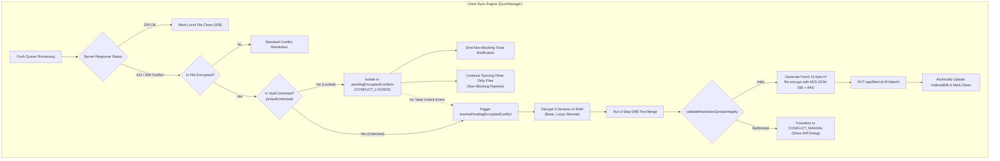
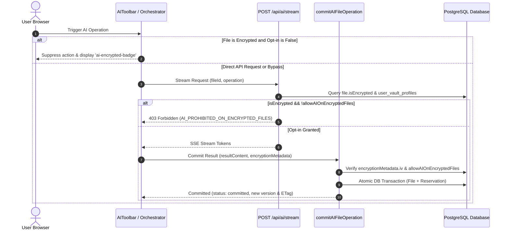

# Vault Phase 4 Closure: AI Safety Gatekeepers, Non-Blocking Sync with Conflict Isolation & Markdown Syntax Integrity

## 1. Executive Summary & Objective

Vault Phase 4 establishes strict dual-layer Zero-Knowledge AI safety barriers, non-blocking encrypted conflict isolation, and deterministic post-merge syntax integrity validation within the LUGX Hybrid Encryption architecture (`docs/.Plans/وثيقة الخطة التنفيذية لتشفير الهجين والخزنة المشفرة عند الطلب.md`, lines 426–487).

Key achievements:
- **Zero-Knowledge AI Safety Gatekeepers**:
  - Client-side UI shield (`src/components/editor/ai-toolbar.tsx`, `src/hooks/use-editor-orchestrator.ts`): Completely hides AI toolbars, disables generation shortcuts, and mounts an amber privacy badge (`data-testid="ai-encrypted-badge"`) when viewing encrypted files without explicit user opt-in.
  - Server-side route barrier (`src/app/api/ai/stream/route.ts`): Validates file encryption state and rejects unpermitted requests immediately with HTTP `403 Forbidden` (`AI_PROHIBITED_ON_ENCRYPTED_FILES`) prior to token reservation.
  - Server-side atomic commit guard (`src/server/actions/ai-commit.ts`): Strictly rejects plaintext commits to encrypted files and verifies user opt-in preference with automatic reservation refund.
  - User preference persistence (`src/server/actions/vault-actions.ts`, `src/components/vault/vault-security-card.tsx`, `src/lib/db/schema.ts`, PostgreSQL migration `0010_add_vault_ai_setting.sql`): Adds `allowAIOnEncryptedFiles` column with dynamic toggle and visual feedback.
- **Deterministic Strong ETag Generation for Encrypted Envelopes (`src/lib/sync/etag-generator.ts`)**:
  - Implements canonical JSON key ordering (`CANONICAL_ENVELOPE_KEYS`) to ensure deterministic string representation across Node.js and browser environments.
  - Generates 32-character SHA-256 hex hashes: $\text{ETag} = \text{SHA-256}(\text{serializeEncryptedEnvelope}(\text{envelope}))[0..32]$.
- **Non-Blocking Sync & Conflict Isolation (`CONFLICT_LOCKED`) (`src/lib/sync/sync-manager.ts`)**:
  - Encrypted files encountering HTTP 412 or 409 while the vault is locked (`!sessionKeyStore.isVaultUnlocked()`) are quarantined into `pendingEncryptedConflicts` tagged with `CONFLICT_LOCKED`.
  - Non-blocking sync invariant: `pushDirtyFiles` explicitly filters out locked encrypted files, allowing clean unencrypted files to sync concurrently without delay.
  - Emits non-blocking notification events (`onEncryptedConflictLocked`).
- **Post-Unlock 3-Way Merge & Markdown Syntax Integrity (`src/lib/sync/syntax-validator.ts`, `src/lib/sync/conflict-resolver.ts`)**:
  - Upon vault unlock, decrypts remote, local, and base envelopes in volatile RAM, executes Diff3 text merge, and verifies structural Markdown integrity.
  - Rejects unclosed code fences (```` / `~~~`), malformed GFM tables (column count mismatch between header and delimiter), null bytes (`\0`), and conflict markers (`<<<<<<<`).
  - On valid merge: re-encrypts with a fresh CSPRNG 12-byte IV and file-bound AAD, pushes to server with `If-Match`, removes pending conflict, and marks the file clean.
  - On validation failure: transitions to `CONFLICT_MANUAL` for explicit side-by-side resolution.
- **Adversarial Hardening & Anti-Overengineering Decisions**:
  - **REST API Boundary Guard (`src/app/api/files/[id]/route.ts`)**: Rejects direct PUT requests with `isEncrypted: true` missing `encryptionMetadata.iv` with HTTP 400, eliminating plaintext storage leakage.
  - **Stale ETag Self-Healing**: Failed auto-resolution pushes are evicted from `pendingEncryptedConflicts` allowing the subsequent regular sync cycle to handle them as standard conflicts, avoiding permanent loop lockouts.
  - **Stateless Self-Healing over Zombie Locks**: Retained transient in-memory isolation with deterministic 412 re-quarantining, deliberately rejecting persistent IndexedDB lock flags to prevent cross-tab zombie locks.
  - **Serialized Auto-Resolution**: Unlocking iterates through pending conflicts with sequential `await` rather than uncontrolled parallel bursts, avoiding Web Worker message flooding without external queue libraries.

---

## 2. Architecture & Workflows

### A. Non-Blocking Sync with Encrypted Conflict Isolation



### B. Zero-Knowledge AI Gatekeeper Sequence



---

## 3. Implementation Details & File Inventory

| Component | Target File | Responsibility |
| :--- | :--- | :--- |
| **Syntax Validator** | `src/lib/sync/syntax-validator.ts` | Structural Markdown validator for code fences, GFM tables, control chars, and conflict markers. |
| **ETag Generator** | `src/lib/sync/etag-generator.ts` | Deterministic canonical JSON key ordering and SHA-256 ETag generation for encrypted envelopes. |
| **Sync Manager** | `src/lib/sync/sync-manager.ts` | `pendingEncryptedConflicts` queue, non-blocking filtering in `pushDirtyFiles`, unlock auto-resolution. |
| **Conflict Resolver** | `src/lib/sync/conflict-resolver.ts` | Centralized syntax integrity delegation to `validateMarkdownSyntaxIntegrity`. |
| **AI Stream Route** | `src/app/api/ai/stream/route.ts` | HTTP 403 `AI_PROHIBITED_ON_ENCRYPTED_FILES` gatekeeper for encrypted documents. |
| **AI Commit Action** | `src/server/actions/ai-commit.ts` | Transactional commit validation, unencrypted commit rejection, re-encrypted ETag calculation. |
| **Vault Server Actions** | `src/server/actions/vault-actions.ts` | `updateVaultAISetting` for managing user AI opt-in status on encrypted files. |
| **Vault Security Card** | `src/components/vault/vault-security-card.tsx` | Interactive UI toggle for AI access preference on encrypted documents. |
| **AI Toolbar** | `src/components/editor/ai-toolbar.tsx` | Gated toolbar rendering `ai-encrypted-badge` and disabling AI menus on encrypted files. |
| **Editor Orchestrator** | `src/hooks/use-editor-orchestrator.ts` | Privacy check in `startAIOperation`, vault profile loading, conflict payload passthrough. |
| **Database Schema** | `src/lib/db/schema.ts` | Added `allowAIOnEncryptedFiles` column to `user_vault_profiles`. |
| **Migration** | `src/lib/db/migrations/0010_add_vault_ai_setting.sql` | PostgreSQL DDL migration script adding `allow_ai_on_encrypted_files`. |
| **Test Verification** | `src/test/vault-sync-ai-gate.test.ts` | 28 automated tests covering all Phase 4 gatekeeper, sync, and syntax requirements. |

---

## 4. Verification Evidence & Test Matrix

All tests passed with zero regressions across the codebase:

```
Test Files  46 passed (46)
     Tests  657 passed (657)
  Duration  ~90s
```

### Specific Suites:
1. `src/test/vault-sync-ai-gate.test.ts`:
   - 28/28 tests passed.
   - Covers: Markdown syntax integrity validation (fences, tables, null bytes, markers), ETag generation determinism, Zero-Knowledge AI streaming 403 rejection, atomic AI commit re-encryption enforcement, vault AI setting persistence, non-blocking `CONFLICT_LOCKED` isolation, concurrent clean file push, automatic resolution upon vault unlock.
2. `src/test/vault-cross-module.integration.test.ts`:
   - 5/5 tests passed.
   - Covers: Full Zero-Knowledge lifecycle, encrypted copy pipeline (AUD-02), AI stream commit with re-encryption and opt-in, 412 double-encryption prevention (AUD-03), central device trust revocation (AUD-05).
3. `src/test/ai-server-atomic-commit.test.ts`:
   - 13/13 tests passed.
   - Covers: Optimistic concurrency guards, self-healing, transactional reservation settlement, encrypted payload commit.
4. `npx tsc --noEmit`:
   - 0 TypeScript compilation errors.
