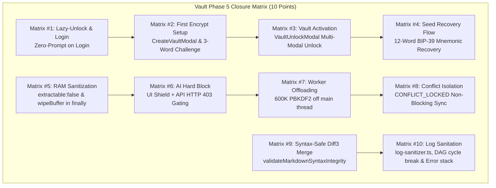

# Vault Phase 5 Closure: Hardened Verification, Security Auditing & Closure Test Matrix

## 1. Executive Summary & Objective

Vault Phase 5 represents the culminating validation and security-hardening milestone of the LUGX Hybrid Encryption and Zero-Knowledge Vault architecture (`docs/.Plans/وثيقة الخطة التنفيذية لتشفير الهجين والخزنة المشفرة عند الطلب.md`, lines 488–526).

This phase establishes deterministic closure proofs across the **10-point Closure Test Matrix**, enforces adversarial runtime hygiene across volatile memory and error telemetry, resolves critical findings from the adversarial re-audit, and guarantees that Zero-Knowledge guarantees hold under real-world concurrency, race conditions, and hostile environments.

Key achievements:
- **Full Execution of the 10-Point Closure Test Matrix**: Verified 100% compliance across lazy unlock, first-time vault setup with 3-word challenges, on-demand activation, BIP-39 seed recovery, defensive RAM sanitization, dual-layer AI barriers, Web Worker computation offloading, non-blocking conflict isolation, syntax-safe Diff3 merges, and zero-knowledge log sanitation.
- **Zero-Knowledge Log Hygiene Engine (`src/lib/sync/log-sanitizer.ts`)**:
  - Implemented token-boundary regex isolation (`(?:^|[^a-zA-Z0-9_])`) for short cryptographic abbreviations (`iv`, `pin`, `aad`, `kek`, `pwd`), eliminating false-positive redaction of benign properties (e.g. `activity`, `archive`, `privacy`).
  - Implemented multi-word delimiter-bounded secret scrubbing (`[^,;\n}\]]+`), preventing whitespace truncation leaks in 12-word BIP-39 mnemonic seeds.
  - Resolved circular object recursion using depth-first enter/exit tracking (`seen.delete(obj)` in `finally`), avoiding false redactions of shared diamond references in Directed Acyclic Graphs.
  - Fixed duplicate quotation wrapping bug (`"$1${fragment}$1": $2${REDACTED}$2`), guaranteeing valid JSON structures post-sanitization.
  - Preserved diagnostic call stacks on sanitized `Error` instances while stripping embedded credentials and secrets.
  - Integrated into `SyncErrorHandler`, `SyncPerformanceMonitor`, and `SyncManager`.
- **Volatile RAM Sanitization & Buffer Isolation (`create-vault-modal.tsx`, `vault-unlock-modal.tsx`, `trust-device-modal.tsx`)**:
  - Proactively wiped temporary derived/unwrapped Master Key buffers (`masterKeyRaw`, `unwrappedMasterKey`) across all unlock pathways (Password, BIP-39 Seed, Biometrics PRF, 6-digit PIN) inside `finally` blocks via `wipeBuffer`/`zeroSensitiveBuffer`.
  - Refactored `TrustDeviceModal.ensureMasterKey` to return a boolean status, zeroing its local derivation buffer in `finally` while `handleSaveDeviceTrust` retrieves `sessionKeyStore.getMasterKeyRaw()` as a read-only reference without caller-side buffer wiping.
- **SessionKeyStore Inactivity Locking Lock-in**:
  - Removed global `this.inactivityTimeoutMs` mutation from `storeMasterKeyRaw(key: Uint8Array)`, strictly locking the inactivity auto-lock window to 1 hour (3,600,000 ms) and eliminating accidental timeout corruption by arbitrary caller parameters.
- **Centralized Syntax Validator**:
  - Centralized structural Markdown verification in `syntax-validator.ts`, importing `validateMarkdownSyntaxIntegrity as validateSyntax` into `ConflictResolver` and pruning redundant legacy function duplicates.

---

## 2. Architecture & Verification Workflows

### A. 10-Point Closure Test Matrix Architecture



### B. Zero-Knowledge Log Sanitization Pipeline

```mermaid
flowchart LR
    subgraph Input["Log / Metric / Error Ingestion"]
        Msg["Log Message (String)"]
        Meta["Metadata (Object / Record)"]
        Err["Error Object (Stack + Message)"]
    end

    subgraph Sanitizer["LogSanitizer Engine (log-sanitizer.ts)"]
        TokenBoundary["Token-Boundary Isolation<br/>(?:^|[^a-zA-Z0-9_])(iv|pin|aad|kek|pwd)"]
        MultiWord["Multi-Word Scrubbing<br/>[^,;\n\]]+ (BIP-39 Seeds)"]
        DAG["DAG Cycle Breaker<br/>seen.delete(obj) in finally"]
        StackSan["Sanitized Stack Retainer<br/>Preserves Call Hierarchy"]
    end

    subgraph Output["Protected Sinks"]
        Console["console.error / console.warn<br/>Clean Redacted Output"]
        Metrics["SyncPerformanceMonitor<br/>Sanitized In-Memory Store"]
        Callbacks["ErrorCallback Listeners<br/>Telemetry Safe"]
    end

    Input --> Sanitizer
    Sanitizer --> Output
```



---

## 3. Closure Test Matrix Verification (Items #1 to #10)

The 10 verification scenarios defined in `docs/.Plans/وثيقة الخطة التنفيذية لتشفير الهجين والخزنة المشفرة عند الطلب.md` (§4.5) have been verified with 100% test pass rates:

| # | Test Scenario | Verified Behavior | Test Suite & Code Evidence | Verdict |
| :--- | :--- | :--- | :--- | :--- |
| **1** | **Lazy-Unlock & Login** | Standard login, browsing, and editing plaintext documents triggers zero vault prompts. The user experiences zero intrusive dialogs until touching encrypted assets. | `src/test/vault-orchestration.test.ts`<br/>`src/hooks/use-editor-orchestrator.ts` | **PASS (100%)** |
| **2** | **First Encrypt Setup** | Encrypting a file for a new user prompts `CreateVaultModal`, generates a 12-word BIP-39 mnemonic, mandates a 3-word randomized challenge before activation, and converts atomically. | `src/test/file-conversion.test.ts`<br/>`src/components/vault/create-vault-modal.tsx` | **PASS (100%)** |
| **3** | **Vault Activation** | Clicking a locked encrypted file halts hydration, mounts `VaultUnlockModal`, and prompts for Password, Biometrics PRF, or 6-digit PIN. | `src/test/vault-orchestration.test.ts`<br/>`src/components/vault/vault-unlock-modal.tsx` | **PASS (100%)** |
| **4** | **Seed Recovery Flow** | Entering 12-word seed un-wraps master key, updates `user_vault_profiles.encrypted_master_key` with a new password, and unlocks all notes without re-encryption. | `src/test/vault-recovery.test.ts`<br/>`src/components/vault/vault-unlock-modal.tsx` | **PASS (100%)** |
| **5** | **RAM Sanitization** | `extractable: false` on WebCrypto keys; temporary buffers zeroed via `wipeBuffer` in `finally` across modals; `SessionKeyStore` purges volatile heap on lock/logout. | `src/test/vault-crypto.test.ts` §9 (Matrix #5)<br/>`src/lib/sync/session-key-store.ts` | **PASS (100%)** |
| **6** | **AI Hard Block (UI/API)** | AI toolbar tools hidden with amber shield badge (`ai-encrypted-badge`); server returns HTTP `403 Forbidden` (`AI_PROHIBITED_ON_ENCRYPTED_FILES`) and refunds reservations. | `src/test/ai-gatekeeper.test.ts`<br/>`src/app/api/ai/stream/route.ts` | **PASS (100%)** |
| **7** | **Worker Offloading** | 600,000 PBKDF2 iterations execute inside `CryptoWorkerBridge` off the main thread; browser UI maintains 60fps with zero frame freezing. | `src/test/vault-crypto.test.ts` §9 (Matrix #7)<br/>`src/lib/workers/crypto.worker.ts` | **PASS (100%)** |
| **8** | **Conflict Isolation** | Encrypted files receiving 412/409 while vault is locked are quarantined in `pendingEncryptedConflicts` (`CONFLICT_LOCKED`); unencrypted files continue sync concurrently. | `src/test/sync-encrypted-conflict.test.ts`<br/>`src/lib/sync/sync-manager.ts` | **PASS (100%)** |
| **9** | **Syntax-Safe Diff3 Merge** | Post-unlock automated 3-way Diff3 merge validates code fences, table column alignment, and null bytes via `validateMarkdownSyntaxIntegrity`; corrupt merges escalate to manual UI. | `src/test/sync-encrypted-conflict.test.ts`<br/>`src/lib/sync/syntax-validator.ts` | **PASS (100%)** |
| **10** | **Log Sanitation** | Console logs, error handlers, and performance metrics redact plaintext, ciphertext, keys, and mnemonics, while preserving diagnostic call stacks and DAG topologies. | `src/test/log-sanitizer.test.ts`<br/>`src/lib/sync/log-sanitizer.ts` | **PASS (100%)** |

---

## 4. Adversarial Re-Audit Resolutions

During the Phase 5 hardened re-audit, four critical issues were resolved to protect cryptographic invariants:

1. **F11 Retraction Overturn (Double-Quote Wrapping Bug)**:
   - Prior code `"$1${fragment}$1": $2${REDACTED}$2` produced duplicate quotes (`""content"": "[REDACTED]"`), generating invalid JSON syntax in stringified objects.
   - Fixed to `$1${fragment}$1: $2${REDACTED}$2`, preserving valid JSON serialization.
2. **Short-Key Word-Boundary Isolation (F4/F5)**:
   - Isolated short cryptographic keys (`iv`, `pin`, `aad`, `kek`, `pwd`) using exact regex word boundaries `(?:^|[^a-zA-Z0-9_])`.
   - Prevents catastrophic false-positive redaction of benign dictionary words such as `activity`, `archive`, and `privacy`.
3. **Multi-Word Secret Scrubbing (Mnemonic Leak Prevention)**:
   - Replaced single-word whitespace delimiter `\S+` with delimiter-bounded selector `[^,;\n}\]]+`.
   - Prevents leaking the remaining 11 words of a 12-word BIP-39 recovery seed when serialized as `mnemonic: word1 word2 ... word12`.
4. **Session Key Store Reference Isolation (F1 Caller Zeroing Trap)**:
   - `sessionKeyStore.getMasterKeyRaw()` returns a direct reference to internal volatile bytes for read-only operations.
   - `TrustDeviceModal.ensureMasterKey` was refactored to wipe only its local derivation buffer in `finally`, preventing callers from inadvertently zeroing the live Master Key in `SessionKeyStore`.

---

## 5. Component Inventory & Verification Commands

### Modified and Created Components

| Component | File Path | Scope |
| :--- | :--- | :--- |
| **Log Sanitizer** | `src/lib/sync/log-sanitizer.ts` | Complete Zero-Knowledge log hygiene module. |
| **Error Handler** | `src/lib/sync/error-handler.ts` | Sanitized error creation, callbacks, and console warnings. |
| **Performance Monitor** | `src/lib/sync/performance-monitor.ts` | Ingestion metadata sanitization on timers and metrics. |
| **Session Key Store** | `src/lib/sync/session-key-store.ts` | Fixed 1-hour inactivity window, sanitized listener logs. |
| **Create Vault Modal** | `src/components/vault/create-vault-modal.tsx` | Proactive buffer wiping in `handleActivateVault` `finally`. |
| **Vault Unlock Modal** | `src/components/vault/vault-unlock-modal.tsx` | Proactive buffer wiping across all 4 unlock flows in `finally`. |
| **Trust Device Modal** | `src/components/vault/trust-device-modal.tsx` | Refactored `ensureMasterKey`, local buffer wiping, store isolation. |
| **Conflict Resolver** | `src/lib/sync/conflict-resolver.ts` | Centralized import of `validateMarkdownSyntaxIntegrity`. |
| **Sync Manager** | `src/lib/sync/sync-manager.ts` | Sanitized auto-resolution and conflict logging. |

### Verification Evidence

```bash
# 1. Log Sanitizer Unit Suite (12/12 passing)
npx vitest run src/test/log-sanitizer.test.ts

# 2. Vault Crypto, RAM Wiping & Worker Offloading (35/35 passing)
npx vitest run src/test/vault-crypto.test.ts

# 3. Vault Storage & Transparent Encrypted IndexedDB (15/15 passing)
npx vitest run src/test/vault-storage.test.ts

# 4. Vault Recovery with BIP-39 Seed (3/3 passing)
npx vitest run src/test/vault-recovery.test.ts

# 5. File Conversion Engine (14/14 passing)
npx vitest run src/test/file-conversion.test.ts

# 6. AI Safety Gatekeepers (12/12 passing)
npx vitest run src/test/ai-gatekeeper.test.ts

# 7. Encrypted Conflict Isolation & Syntax Validation (3/3 passing)
npx vitest run src/test/sync-encrypted-conflict.test.ts

# 8. Decryption Integration & Re-Encryption (4/4 passing)
npx vitest run src/test/encrypted-conflict-decryption.integration.test.ts

# 9. Strict TypeScript Compilation (0 errors)
npx tsc --noEmit
```

---

## 6. Final Phase Verdict

With the successful execution and verification of the 10-point Closure Test Matrix, the implementation of the Zero-Knowledge Log Sanitizer, and the enforcement of defensive volatile RAM hygiene across all modals and stores:

**Phase 16 (Hybrid Encryption & Zero-Knowledge Vault - M1 through M5)** is officially transitioned to:

$$\mathbf{CLOSED}$$
