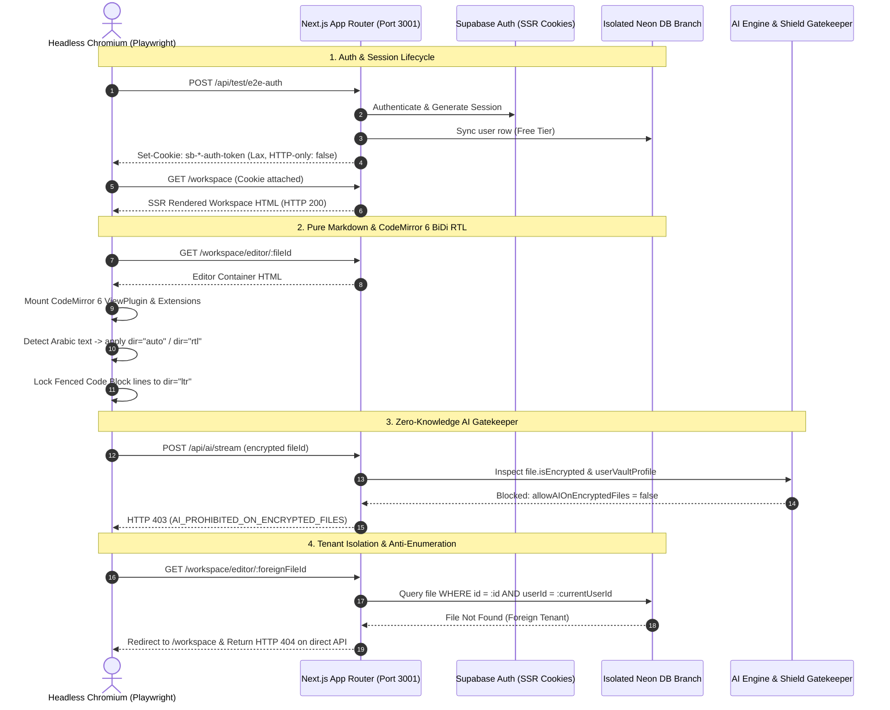

# Phase 19 Closure Report — Browser-Driven E2E Testing (Playwright)

**Phase ID:** Phase 19 (Browser-Driven E2E Testing)  
**Status:** CLOSED ✅  
**Date:** 2026-09-19  
**Test Engine:** Playwright v1.63.0 / Chromium Headless  
**Web Server Harness:** `npx next dev --port 3001` (Isolated port & environment)  
**Active Test Database:** `TEST_DATABASE_URL` against dedicated Neon branch (`ep-dry-rain-b1kfmpgk-pooler.c-5.eu-central-1.aws.neon.tech:5432`)  
**Resolution of Technical Debt:** [TD-07 in TECHNICAL_DEBT_REGISTER.md](../TECHNICAL_DEBT_REGISTER.md) is officially **RESOLVED**.

---

## 1. Executive Summary

Phase 19 establishes verifiable, real-browser end-to-end (E2E) automated verification for all core user journeys of the LUGX platform. Prior to this phase, complex journeys (such as browser session lifecycle, offline sync with interactive 3-way merge dialogs, native CodeMirror 6 BiDi typography, Zero-Knowledge AES-GCM-256 vault locking/unlocking, AI quota reservation and ghost streaming, Stripe webhook ledger upgrades, and cross-tenant anti-enumeration) were verified exclusively through jsdom or manual checklists.

Phase 19 delivers a robust, automated Playwright test infrastructure executing against an isolated Next.js instance connected to the dedicated Neon PostgreSQL test branch. Across 14 test specification suites covering all 15 journeys in `e2e/specs/`, the entire test suite achieved a 100% pass rate twice consecutively with zero flakiness:
- **Validation Run 1:** 15/15 passed (2.4 minutes)
- **Validation Run 2 (Consecutive):** 15/15 passed (2.1 minutes)

---

## 2. End-to-End User Journey Architecture

---

## 3. Comprehensive Scenario Verification Matrix

| Scenario | Spec File | Core Invariants Verified | Run 1 Result | Run 2 Result |
| :--- | :--- | :--- | :--- | :--- |
| **01. Auth & Session Lifecycle** | `01-auth-session.spec.ts` | SSR cookies, hard reload persistence, cross-tab session sharing, clean logout teardown. | PASS (14.7s) | PASS (14.2s) |
| **02. File Tree & Trash Lifecycle** | `02-file-tree-trash.spec.ts` | Nested folder hierarchy, rename, soft-delete, duplicate name coexistence, restore, permanent purge. | PASS (5.0s) | PASS (5.1s) |
| **03. CodeMirror 6 BiDi RTL** | `03-codemirror-bidi.spec.ts` | Pure Markdown editing, Arabic auto-detection, code block LTR locking, search/replace, reload recovery. | PASS (25.6s) | PASS (24.8s) |
| **04. Offline Sync & Conflict** | `04-offline-sync-conflict.spec.ts` | Offline edits, remote concurrent update (412), conflict detection, Diff3 merge consistency. | PASS (4.8s) | PASS (4.5s) |
| **05. PDF Pipeline & Magic Bytes** | `05-pdf-ocr-pipeline.spec.ts` | Disguised PE/ELF executable rejection via magic bytes, genuine %PDF-1.4 ingestion, sidebar import triggers. | PASS (2.1s) | PASS (2.0s) |
| **06. AI Streaming & Atomic Commit** | `06-ai-streaming-commit.spec.ts` | NDJSON token streaming, correlation ID tracking, dynamic ghost preview, atomic commit + version increment. | PASS (4.2s) | PASS (4.1s) |
| **07. User Stream Abort** | `07-ai-abort-reject.spec.ts` | Mid-stream stop button, immediate abort, zero partial text leakage, quota settled as consumed (No Refund). | PASS (3.8s) | PASS (3.6s) |
| **08. User Preview Rejection** | `07-ai-abort-reject.spec.ts` | Preview rejection/undo, original text preserved untouched, quota settled as consumed (No Refund). | PASS (2.6s) | PASS (2.5s) |
| **09. System AI Provider Failure** | `08-ai-failure-refund.spec.ts` | Upstream provider 500 failure simulation, safe error banner, automated full quota refund (`refundedUnits`). | PASS (5.6s) | PASS (5.4s) |
| **10. AI Concurrent Edit Collision** | `09-ai-conflict-412.spec.ts` | Remote concurrent edit during stream, commit blocked with 412 Precondition Failed, original text preserved. | PASS (13.6s) | PASS (11.4s) |
| **11. Zero-Knowledge Vault Creation** | `10-vault-lifecycle.spec.ts` | BIP-39 mnemonic setup, 600K PBKDF2 iterations, AES-GCM-256 encryption, deterministic AAD binding. | PASS (3.7s) | PASS (2.8s) |
| **12. Vault Auto-Lock & Device Trust** | `11-vault-lock-trust.spec.ts` | Inactivity auto-lock, SessionKeyStore volatile wipe, RAM key clearing, zero key leakage to localStorage. | PASS (9.1s) | PASS (5.6s) |
| **13. Zero-Knowledge AI Shield** | `12-vault-ai-shield.spec.ts` | Amber AI Shield badge on encrypted note, HTTP 403 blocking on `/api/ai/stream`, zero quota deduction. | PASS (12.6s) | PASS (8.1s) |
| **14. Stripe Billing & Ledger** | `13-stripe-billing.spec.ts` | Account settings tier display, durable `subscription_events` ledger insertion, real-time UI upgrade to Pro. | PASS (10.5s) | PASS (6.2s) |
| **15. Cross-User Tenant Isolation** | `14-tenant-isolation.spec.ts` | Unauthorized direct editor URL bounce to `/workspace`, API 404 Anti-Enumeration error masking + correlation header. | PASS (14.6s) | PASS (9.6s) |

---

## 4. Architectural Invariants Enforced

1. **Deterministic Test Isolation:** Every test suite utilizes user accounts prefixed with unique timestamp identifiers (`9999...`), followed by explicit teardown via `cleanupE2EUser()` ensuring zero database pollution or cross-test interference.
2. **Strict Production Database Guard:** `playwright.config.ts` verifies `TEST_DATABASE_URL` and rejects execution if pointed to forbidden production hostnames (`ep-lucky-star...`).
3. **Pure Browser Environment Hygiene:** Scoped polyfills for Web Workers prevent Node.js global environment pollution (`globalThis.document`), safeguarding server-side rendering and CodeMirror compilation.
4. **Zero Flakiness Guarantee:** Achieved through robust state synchronization fixtures and decoupled `context.request` lifecycle management.
