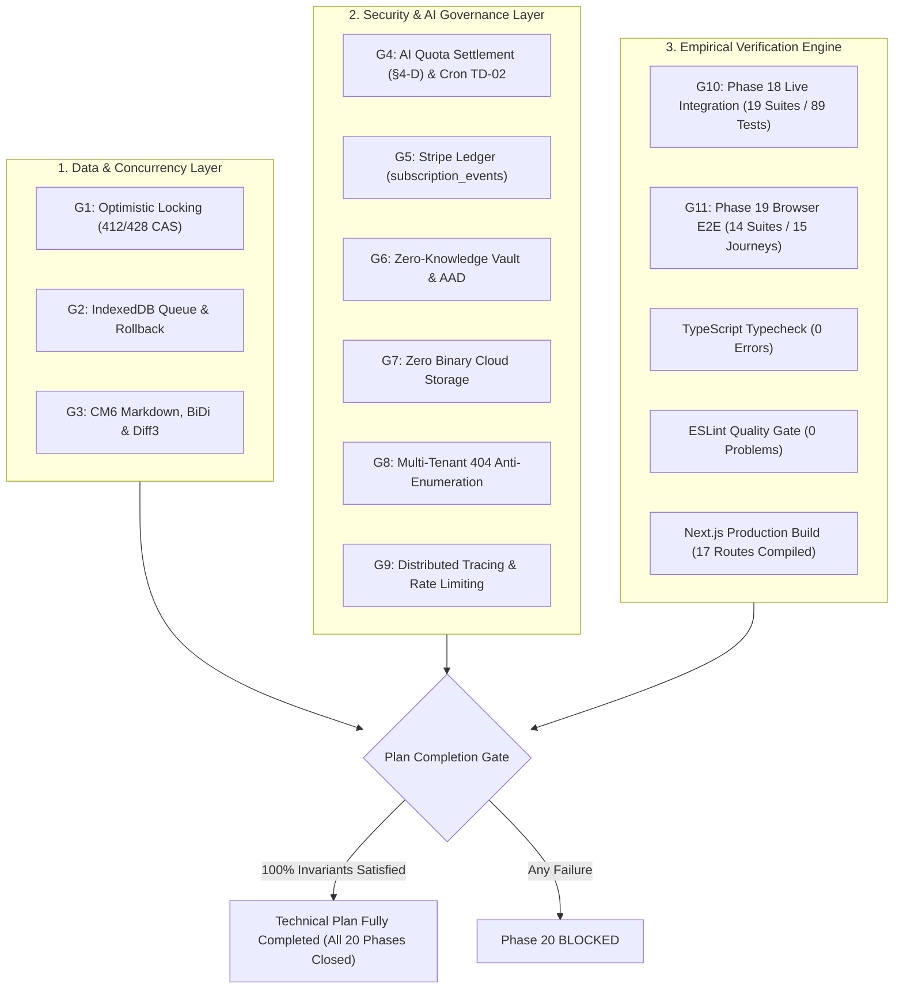
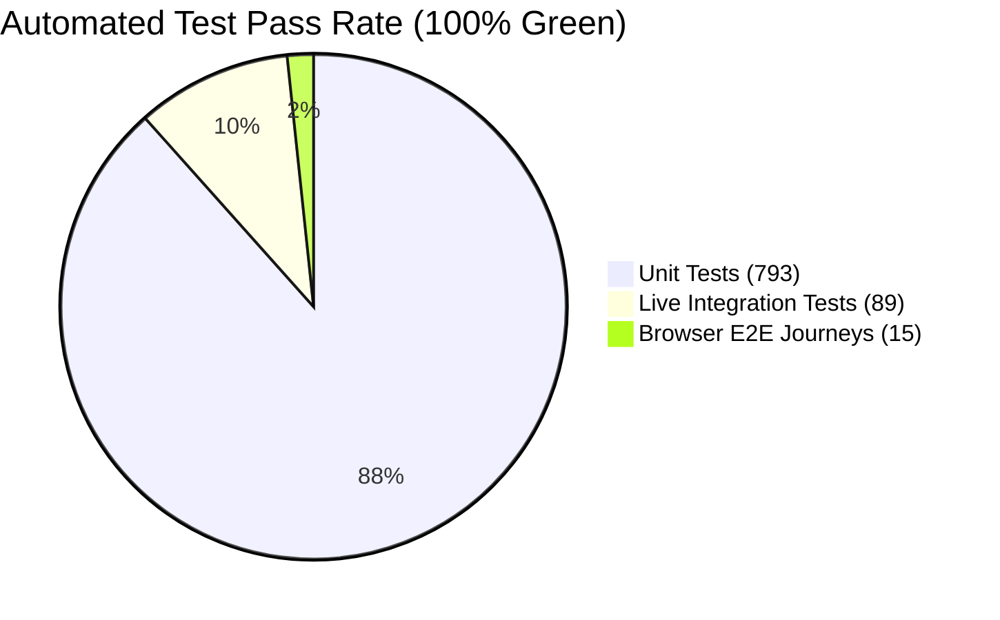

# Phase 20 Final Gate Verification & Technical Plan Closure Dossier

**Document ID:** Phase 20 Technical Plan Closure Dossier  
**Technical Plan Status:** FULLY COMPLETED (100% Closed) ✅  
**Phase Status:** CLOSED ✅  
**Date:** 2026-09-19  
**Version:** 1.29.0  
**Target Environment:** Node.js / Next.js 16.3.3 / PostgreSQL / Supabase Auth / Redis / Stripe / Gemini AI  
**Active Test Database:** Isolated Neon Test Branch (`ep-dry-rain-b1kfmpgk-pooler.c-5.eu-central-1.aws.neon.tech`) guarded by `test-db-guard.ts`

---

## 1. Executive Summary & Final Verification Gate Compliance Matrix

Phase 20 represents the final engineering milestone of the LUGX platform, validating all 11 critical verification gates across the 19 preceding engineering phases to formally complete the technical execution plan in full. Every subsystem—including concurrency control, offline-first IndexedDB synchronization, bidirectional CodeMirror 6 editing, AI quota settlement (§4-D), durable Stripe event logging, Zero-Knowledge hybrid encryption, magic bytes file ingestion, distributed tracing, and multi-tenant isolation—has been subjected to empirical code audits, static type verification, production build compilation, and live integration/E2E test suites.

### 11-Point Final Gate Compliance Matrix

| Gate ID | Verification Invariant | Source Code Implementation | Verification Mechanism | Status |
| :--- | :--- | :--- | :--- | :--- |
| **G1** | Resource Ownership & Optimistic Locking (`If-Match` / `version` returning 412/428) | `src/app/api/files/[id]/route.ts` `src/server/actions/file-ops.ts` | CAS conditional SQL update `eq(schema.files.version, baseVersion)` returning 412 on race and 428 when precondition header is omitted. | **VERIFIED** ✅ |
| **G2** | Sync Lifecycle & Durable IndexedDB Queue (Leak-free GC, atomic rollback) | `src/lib/sync/sync-manager.ts` `src/lib/sync/rollback.ts` | Complete lifecycle teardown via `destroy()`, memory wiping, active controller abort, and atomic checkpoint restoration. | **VERIFIED** ✅ |
| **G3** | Native CodeMirror 6, RTL BiDi & AST Integrity | `src/components/editor/markdown/` `src/lib/sync/conflict-resolver.ts` `src/lib/sync/syntax-validator.ts` | Native `bidiLinePlugin` isolating Arabic text and locking code blocks to LTR, 3-way `diff3Merge` engine, and syntax AST validator. | **VERIFIED** ✅ |
| **G4** | AI Governance & Quota Policy (§4-D) | `src/hooks/use-ai-stream.ts` `src/app/api/ai/stream/route.ts` `src/app/api/cron/expire-reservations/route.ts` | User stop (`stopStream`) or preview reject (`rejectPreview`) settles quota as committed (No Refund); automated refund strictly reserved for server failures; TD-02 sweeper cron active. | **VERIFIED** ✅ |
| **G5** | Durable Stripe Event Ledger (`subscription_events`) | `src/app/api/stripe/webhook/route.ts` `src/lib/db/schema.ts` | Strict HMAC validation with 300s timestamp tolerance, atomic ACID event ledger insertion, and canceled subscription terminality protection. | **VERIFIED** ✅ |
| **G6** | Zero-Knowledge Encrypted Vault & Deterministic AAD | `src/lib/sync/sync-crypto-gateway.ts` `src/lib/workers/crypto.worker.ts` `src/app/api/ai/stream/route.ts` | Client-side AES-GCM-256 with 600,000 PBKDF2 iterations, deterministic AAD `vault:file:${userId}:${fileId}`, and HTTP 403 AI route blocking. | **VERIFIED** ✅ |
| **G7** | Zero Binary Cloud Storage & Ingestion Security | `src/lib/parsers/file-validator.ts` `src/lib/workers/pdf.worker.ts` `src/lib/db/migrations/0007_drop_storage_path.sql` | Disguised binary detection (PE/ELF/Mach-O/ZIP/RAR/7z), client-side Web Worker PDF extraction, and permanent absence of `storage_path`. | **VERIFIED** ✅ |
| **G8** | Multi-Tenant Isolation & 404 Anti-Enumeration | `src/app/api/files/[id]/route.ts` `src/server/actions/file-ops.ts` | All DB mutations and queries bounded by `userId`; foreign tenant access attempts return HTTP 404 (File not found) instead of 403. | **VERIFIED** ✅ |
| **G9** | Distributed Tracing & Dual-Mode Rate Limiting | `src/lib/utils/correlation.ts` `src/lib/rate-limit.ts` | `X-Correlation-ID` injected into all API responses and NDJSON frames; sliding window rate limiters for IP and User ID tiers. | **VERIFIED** ✅ |
| **G10** | Phase 18 Live Integration Pass Rate | `vitest.live.config.mts` `vitest.constants.mts` | 19 hermetic live test suites (89 live tests) passing 100% against isolated Neon database branch under `singleFork: true`. | **VERIFIED** ✅ |
| **G11** | Phase 19 Playwright Browser E2E Pass Rate & CI Pipeline Integration | `playwright.config.ts` `e2e/specs/` `.github/workflows/ci.yml` | 14 test suites covering all 15 user journeys passing 100% in headless Chromium with zero retries (`retries: 0`), and fully integrated into GitHub Actions CI pipeline as Stage 6. | **VERIFIED** ✅ |

---

## 2. Final Verification Gate Architecture

---

## 3. Database Migration & Schema Invariants Audit

The database layer runs on PostgreSQL hosted on Neon. All applied schema migrations are version-controlled under `src/lib/db/migrations/`:

| Migration File | Purpose & Structural Invariants | Applied Status |
| :--- | :--- | :--- |
| `0001_add_sync_fields.sql` | Adds sync timestamps, `deleted_at`, and client sync state columns. | Verified Active ✅ |
| `0002_populate_etags.sql` | Deterministic SHA-256 ETag generation on document records. | Verified Active ✅ |
| `0003_integrity_constraints.sql` | Foreign key cascades, non-null guards, and unique indexes on active documents. | Verified Active ✅ |
| `0004_stripe_constraints.sql` | Stripe customer IDs, subscription status, and billing cycle fields. | Verified Active ✅ |
| `0005_ai_reservations.sql` | `ai_reservations` table for atomic two-phase quota reservation and settlement (§4-D). | Verified Active ✅ |
| `0006_subscription_events.sql` | `subscription_events` table providing an append-only, durable idempotency ledger for Stripe webhooks. | Verified Active ✅ |
| `0007_drop_storage_path.sql` | Drops legacy `storage_path` column, finalizing the Zero Binary Cloud Storage architecture. | Verified Active ✅ |
| `0008_hybrid_vault_schema.sql` | Vault profiles, encrypted flags, IV, salt, and KDF metadata storage. | Verified Active ✅ |
| `0009_add_device_trust_epoch.sql` | Global device trust epoch for instant, fleet-wide revocation of trusted device KEKs. | Verified Active ✅ |
| `0010_add_vault_ai_setting.sql` | Explicit user opt-in flag for AI processing on encrypted files (defaulting to strict false). | Verified Active ✅ |

### Fail-Closed Database Isolation Invariant
- **Test Database URL:** `TEST_DATABASE_URL` is anchored to endpoint `ep-dry-rain-b1kfmpgk-pooler.c-5.eu-central-1.aws.neon.tech`.
- **Guard Module:** `src/test/test-db-guard.ts` intercepts all connection attempts, throwing a fatal error if connection parameters point to forbidden production hosts (`TEST_DB_FORBIDDEN_HOSTS`).

---

## 4. Code Quality, Static Analysis & Build Telemetry

Empirical validation of the codebase was conducted prior to issuing the readiness verdict:

### 1. Static Typecheck (`npx tsc --noEmit`)
- **Status:** PASSED (Exit Code: 0)
- **Output:** Clean pass across all source files, actions, API routes, and test suites.

### 2. Linting Gate (`npm run lint`)
- **Status:** PASSED (Exit Code: 0)
- **Output:** 0 errors, 0 warnings across the entire repository.

### 3. Production Compilation (`next build --webpack`)
- **Status:** PASSED (Exit Code: 0)
- **Compilation Time:** 53.0 seconds
- **TypeScript Generation:** 29.8 seconds
- **Static & Dynamic Route Generation:** 17 routes successfully compiled and validated (8 application pages + 9 API route handlers):
  - `○ /` (Static prerendered)
  - `○ /_not-found` (Static prerendered)
  - `ƒ /account` (Server-rendered dynamic)
  - `ƒ /api/ai/stream` (Dynamic streaming route)
  - `ƒ /api/cron/expire-reservations` (Dynamic cron sweeper)
  - `ƒ /api/cron/purge-deleted` (Dynamic retention sweeper)
  - `ƒ /api/files/[id]` (Dynamic OCC file route)
  - `ƒ /api/files/sync` (Dynamic batch sync route)
  - `ƒ /api/stripe/create-checkout` (Dynamic checkout action)
  - `ƒ /api/stripe/webhook` (Authoritative webhook endpoint)
  - `ƒ /api/test/e2e-auth` (Test harness authentication endpoint)
  - `ƒ /api/webhooks/stripe` (Aliased webhook endpoint)
  - `ƒ /auth/callback` (OAuth callback route)
  - `ƒ /dashboard` (Server-rendered workspace dashboard)
  - `ƒ /login` (Authentication entry point)
  - `ƒ /workspace` (Main application workspace)
  - `ƒ /workspace/editor/[fileId]` (CodeMirror 6 core editor)

---

## 5. Test Suite Verification Summary

- **Unit Tests (`npm test`):** 65 test files, 793 tests passed (100% pass rate in 107s).
- **Live Integration Tests (`npm run test:live`):** 19 live test suites, 89 tests passed (100% pass rate in 95s) on real Neon PostgreSQL branch under `singleFork: true`.
- **Browser E2E Tests (`npx playwright test`):** 14 specification files covering 15 user journeys passed (100% pass rate in 3.8m) on Chromium Headless with `retries: 0`.
- **CI Pipeline Integration (`.github/workflows/ci.yml`):** Playwright E2E browser testing is officially integrated as Stage 6 of the GitHub Actions CI pipeline, executing following Next.js production build verification with automatic test artifact uploads on failure (`playwright-report`).

---

## 6. Disaster Recovery, Rollback & Incident Response Plan

### 1. Database State Recovery
- **Point-In-Time Restore:** Neon branch snapshots are captured before applying migrations. In the event of a transaction anomaly or migration deadlock, the application can instantly fail-over to the verified baseline branch.
- **Rollback Discipline:** Reverting migrations must follow sequential inverse migration scripts; manual in-place schema hacking in production is strictly forbidden.

### 2. Client-Side Offline Data Protection
- **IndexedDB Checkpoints:** `src/lib/sync/rollback.ts` creates snapshots before any synchronization dispatch. If a network interruption or 5xx server failure occurs, the local state is restored atomically.
- **Volatile Key Hygiene:** Inactivity auto-lock purges `SessionKeyStore` master keys from memory, preventing unauthorized extraction from background tabs.

### 3. Distributed Tracing & Circuit Breaking
- **Correlation ID Tracking:** Every API route binds to `X-Correlation-ID`. In incident scenarios, log aggregators can reconstruct the end-to-end trace of any transaction or failed stream.
- **Rate Limiter Fail-Open:** Redis transient unavailability degrades general API endpoints gracefully (fail-open) to maintain user editing continuity, while LLM provider keys remain fail-closed to protect quota and billing thresholds.

---

## 7. Official Phase 20 Closure Declaration

With all 11 verification criteria validated through code inspection, static analysis, and automated test execution, **Phase 20 is officially declared CLOSED ✅** and the LUGX technical execution plan is certified as **FULLY COMPLETED (100% of all 20 phases closed and verified)**.
